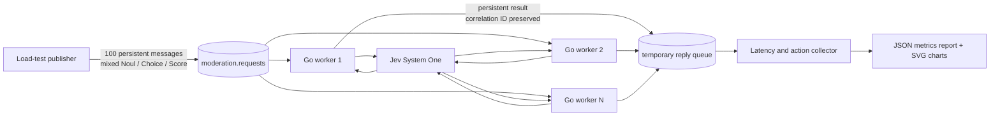

# Moderation load-test flow

```mermaid
flowchart LR
    A[Load-test publisher] -->|100 persistent messages\nmixed Noul / Choice / Score| Q[(moderation.requests)]
    Q --> W1[Go worker 1]
    Q --> W2[Go worker 2]
    Q --> WN[Go worker N]
    W1 --> J[Jev System One]
    W2 --> J
    WN --> J
    J --> W1
    J --> W2
    J --> WN
    W1 -->|persistent result\ncorrelation ID preserved| R[(temporary reply queue)]
    W2 --> R
    WN --> R
    R --> C[Latency and action collector]
    C --> M[JSON metrics report + SVG charts]
```

The benchmark measures full asynchronous round-trip time: publish to RabbitMQ, queue wait, worker processing, Jev evaluation, result publish, and reply consumption.
